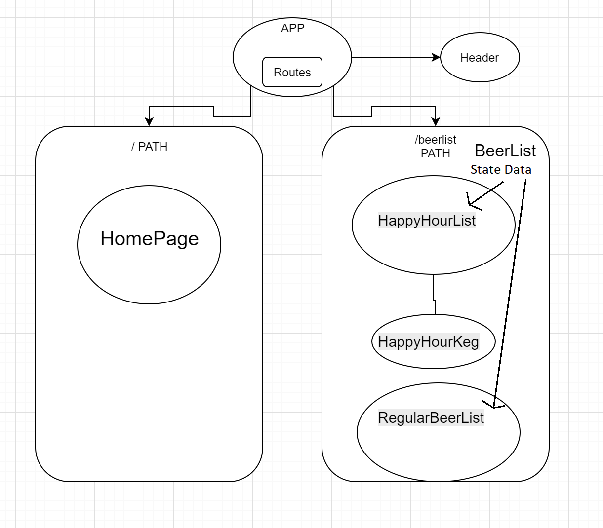

# Tap Room React

#### By Hyung Lee
##### 11/16/18

## Outline Diagram

## Setup/Installation Requirements

  - Clone this repository from https://github.com/HyungNLee/TapRoom-React.git
  - Navigate to the "TapRoom-React" folder in your terminal and type "npm install" to install necessary plugins.
  - Type in "npm run start" in your terminal.
  - Open up your preferred web browswer and navigate to 'http://localhost:8080/'.

## Notes

  * I had trouble replicating calling functions to replace values in CSS. I had to either hard-code or take some values out.

## Support and contact details

  - Hyung Lee - github.com/HyungNLee

## Technologies Used

  - JavaScript
  - Node.js
  - Webpack
  - CSS
  - HTML
  - React
  
This software is licensed under the MIT license.

Copyright (c) 2018 **Hyung Lee**